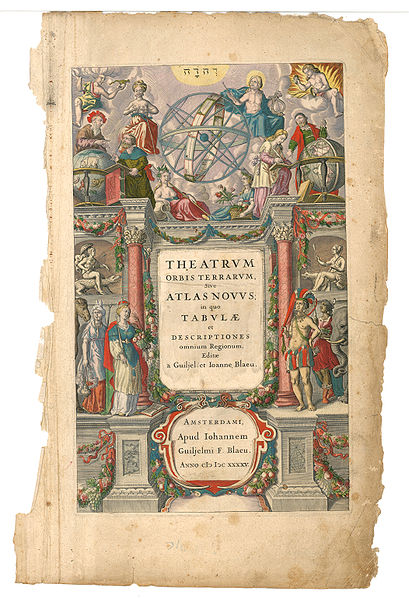

<section class="section content">
  

    

      

        <h2 class="title">De atlas van Willem Blaeu</h2>
        
De Atlas Maior is een omvangrijk samengestelde wereldatlas van de hand van Willem Blaeu, een Nederlandse cartograaf en globemaker. 

        
De atlas begon onder de titel <i>Atlas Novus</i> (Nieuwe Atlas) in 1635, een uitgave in twee delen. Deze werd in 1662 onder de titel Atlas Maior opnieuw uitgeven, maar dan in elf delen in Latijn, en bevatte 594 kaarten.

        
Meer informatie over <a target="_blank" href="https://nl.wikipedia.org/wiki/Willem_Blaeu">Willem Blaeu</a> en de <a target="_blank" href="https://nl.wikipedia.org/wiki/Atlas_Maior_(Blaeu)">Atlas Maior</a>.

        <h2>Deze Atlas Novus</h2>
        
Hoewel dit qua omvang noch vereist talent te vergelijken is met de originele <i>Atlas Novus</i> leek het me toch een passende naam. Ter bewondering voor het werk van Willem Blaeu, maar vooral omdat dit gaat om een nieuwe vorm van cartografie.

        
De kaarten op deze site zijn gemaakt met <a target="_blank" href="https://www.pdok.nl/nl/producten/pdok-downloads/basisregistratie-topografie/topnl/topnl-actueel/top100nl">TOP100NL data</a> van <a target="_blank" href="https://pdok.nl/">PDOK</a>, Publieke Dienstverlening Op de Kaart.

        
Atlas Novus is gemaakt door <a target="_blank" href="https://guushoekman.com">Guus Hoekman</a>.

      

      

        
      

    

  

</section>