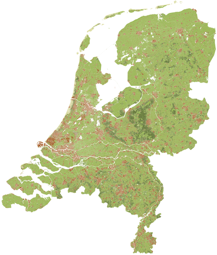
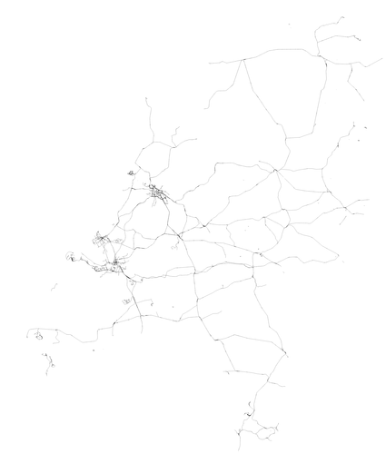

<section class="section maps">
  

    

      

        

          <header class="card-header">
            

              Landgebruik 1:100.000
            

          </header>
          

            

              
            

          

          <footer class="card-footer download">
            

              
              |
              
              ×
              
              <a href="" class="download button is-small is-link">Download</a>
            

          </footer>
          <footer class="card-footer sizes">
            <a url="klein.com" size="16,5 MB" width="2125" height="2500" href="#" class="card-footer-item example">Klein</a>
            <a url="middel.com" size="38,2 MB" width="4250" height="5000" href="#" class="card-footer-item">Middel</a>
            <a url="middel.com" size="38,2 MB" width="8500" height="10000" href="#" class="card-footer-item">Middel</a>
            <a url="poster.com" size="62,5 MB" width="17000" height="20000" href="#" class="card-footer-item">Poster</a>
          </footer>
        

      

      

        

          <header class="card-header">
            

              Water 1:10.000
            

          </header>
          

            

              
            

          

          <footer class="card-footer download">
            

              
              |
              
              ×
              
              <a href="" class="download button is-small is-link">Download</a>
            

          </footer>
          <footer class="card-footer sizes">
            <a url="klein.com" size="16,5 MB" width="2125" height="2500" href="#" class="card-footer-item example">Klein</a>
            <a url="middel.com" size="38,2 MB" width="4250" height="5000" href="#" class="card-footer-item">Middel</a>
            <a url="middel.com" size="38,2 MB" width="8500" height="10000" href="#" class="card-footer-item">Middel</a>
            <a url="poster.com" size="62,5 MB" width="17000" height="20000" href="#" class="card-footer-item">Poster</a>
          </footer>
        

      

      

        

          <header class="card-header">
            

              Wegen 1:100.000
            

          </header>
          

            

              
            

          

          <footer class="card-footer download">
            

              
              |
              
              ×
              
              <a href="" class="download button is-small is-link">Download</a>
            

          </footer>
          <footer class="card-footer sizes">
            <a url="klein.com" size="16,5 MB" width="2125" height="2500" href="#" class="card-footer-item example">Klein</a>
            <a url="middel.com" size="38,2 MB" width="4250" height="5000" href="#" class="card-footer-item">Middel</a>
            <a url="middel.com" size="38,2 MB" width="8500" height="10000" href="#" class="card-footer-item">Middel</a>
            <a url="poster.com" size="62,5 MB" width="17000" height="20000" href="#" class="card-footer-item">Poster</a>
          </footer>
        

      

      

        

          <header class="card-header">
            

              Spoor 1:100.000
            

          </header>
          

            

              
            

          

          <footer class="card-footer download">
            

              
              |
              
              ×
              
              <a href="" class="download button is-small is-link">Download</a>
            

          </footer>
          <footer class="card-footer sizes">
            <a url="klein.com" size="16,5 MB" width="2125" height="2500" href="#" class="card-footer-item example">Klein</a>
            <a url="middel.com" size="38,2 MB" width="4250" height="5000" href="#" class="card-footer-item">Middel</a>
            <a url="middel.com" size="38,2 MB" width="8500" height="10000" href="#" class="card-footer-item">Middel</a>
            <a url="poster.com" size="62,5 MB" width="17000" height="20000" href="#" class="card-footer-item">Poster</a>
          </footer>
        

      

      

        

          <header class="card-header">
            

              Alles 1:100.000
            

          </header>
          

            

              
            

          

          <footer class="card-footer download">
            

              
              |
              
              ×
              
              <a href="" class="download button is-small is-link">Download</a>
            

          </footer>
          <footer class="card-footer sizes">
            <a url="klein.com" size="16,5 MB" width="2125" height="2500" href="#" class="card-footer-item example">Klein</a>
            <a url="middel.com" size="38,2 MB" width="4250" height="5000" href="#" class="card-footer-item">Middel</a>
            <a url="middel.com" size="38,2 MB" width="8500" height="10000" href="#" class="card-footer-item">Middel</a>
            <a url="poster.com" size="62,5 MB" width="17000" height="20000" href="#" class="card-footer-item">Poster</a>
          </footer>
        

      

    

  

</section>